# Using a Freestyle Job to deliver Java Libraries with Maven

Prerequisites

- Git Setup: https://github.com/jvalentino/setup-git
- Having setup Docker and Docker Compose: https://github.com/jvalentino/setup-docker
- Local Jenkins: https://github.com/jvalentino/example-docker-jenkins
- Building Java 101: https://github.com/jvalentino/java-building-101
- Maven-Java Part 1: https://github.com/jvalentino/example-java-maven-lib-1
- Maven-Java Part 2: https://github.com/jvalentino/example-java-maven-lib-2
- Maven-Java Part 3: https://github.com/jvalentino/example-java-maven-lib-3
- Maven-Java Part 4: https://github.com/jvalentino/example-java-maven-lib-4

# (1) Credentials

Since we are going to need to publish to a remote Maven repository, we are going to need to add the credentials for it (just like we did in the beginning with Git).

[Manage Jenkins](http://localhost:8080/manage/) -> [Manage Credentials](http://localhost:8080/manage/credentials/) -> [System](http://localhost:8080/manage/credentials/store/system/) -> [Global Credentials (Unrestricted)](http://localhost:8080/manage/credentials/store/system/domain/_/)

We then create a username/password credential named `github-publish-maven` that we will later use in our job:

# (2) Maven config

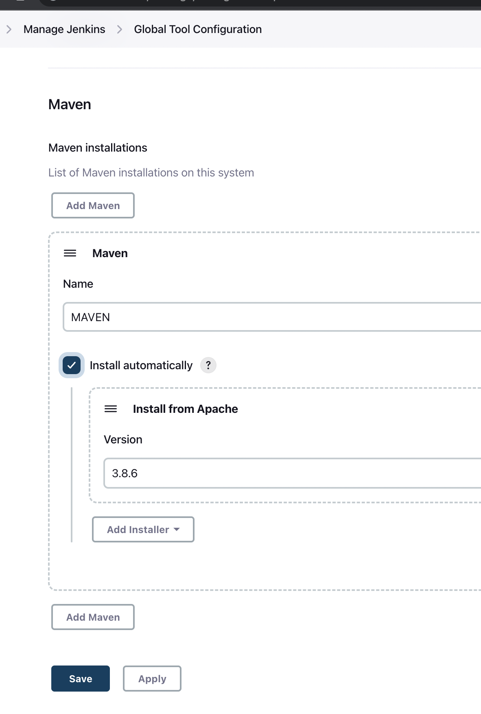

# (3) Initial Job Creation

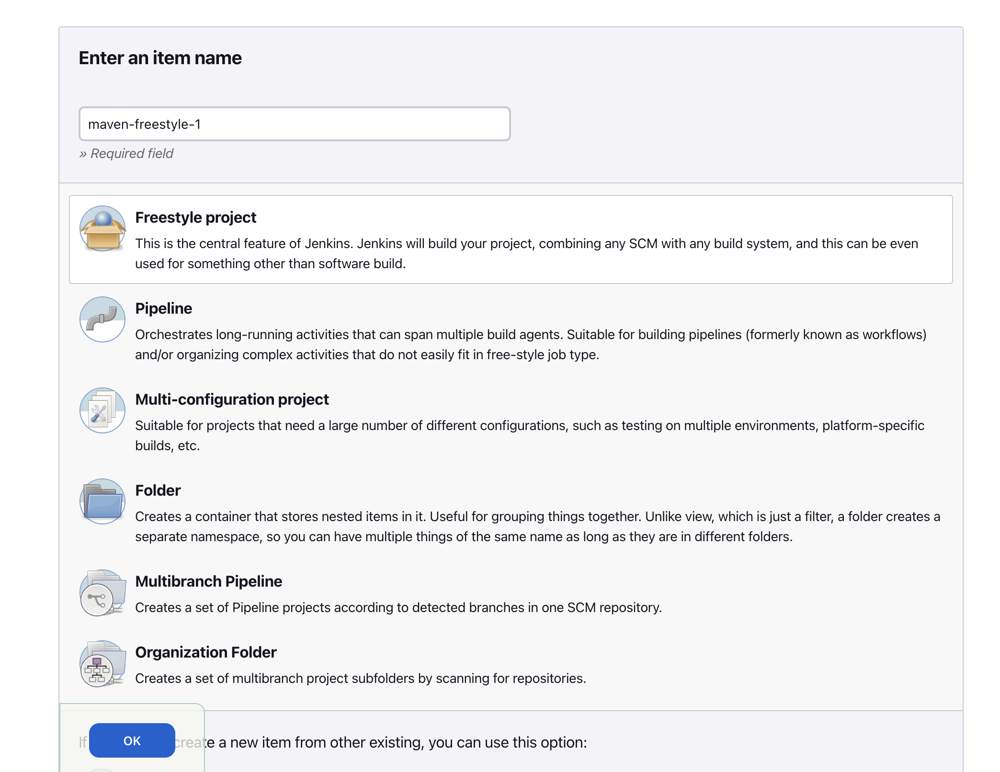

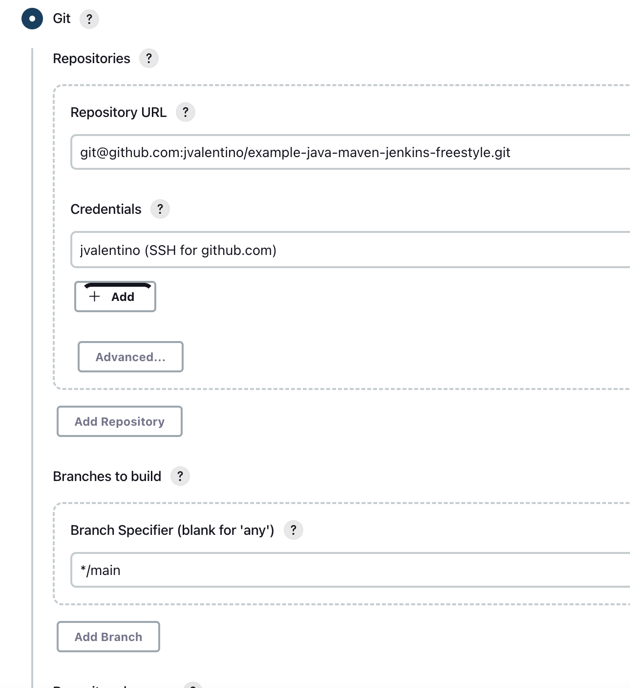

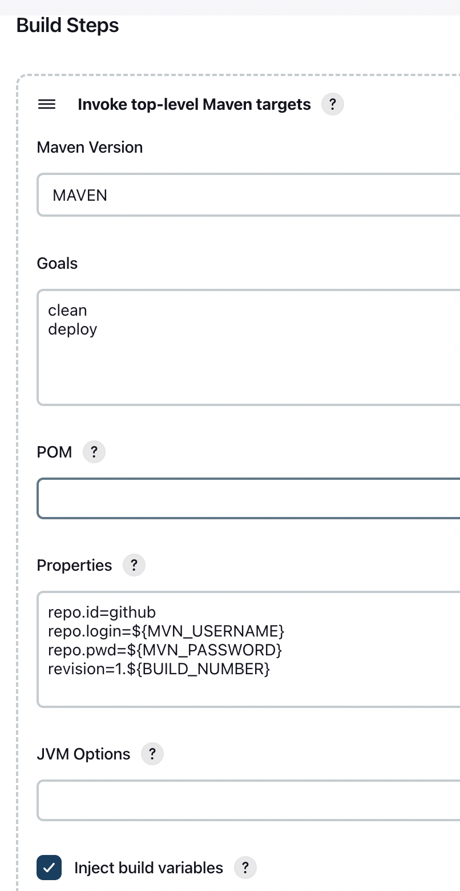

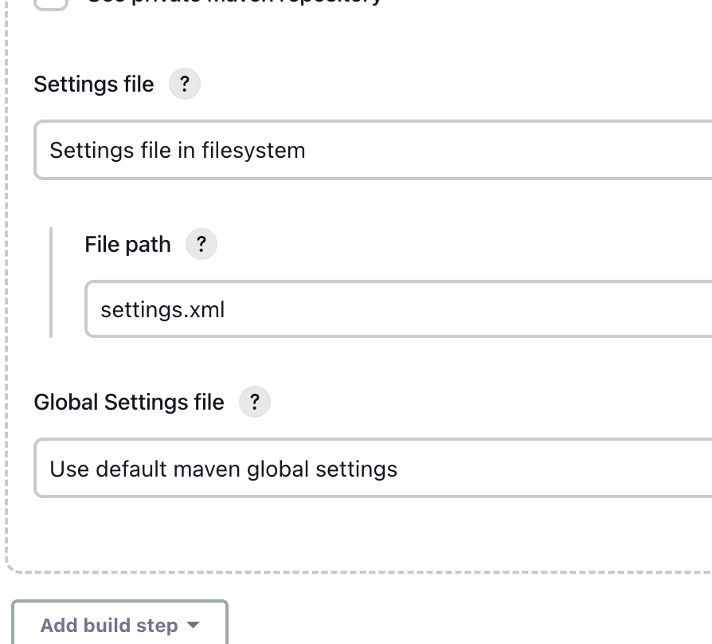

# (4) Running it

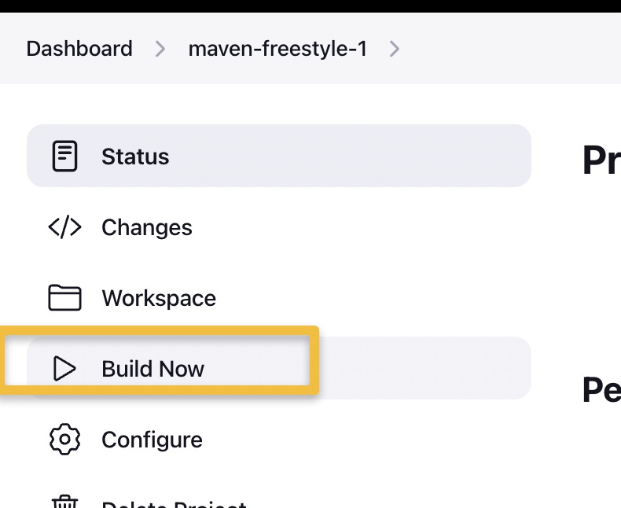

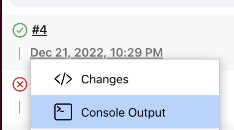

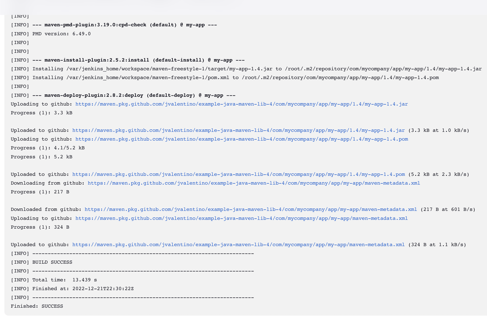

# (5) Tests, Jacoco, and PMD

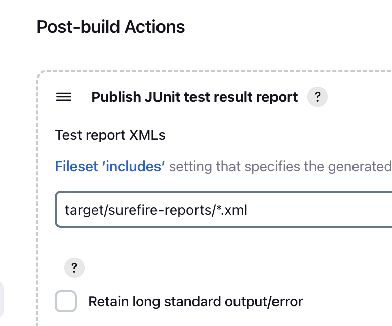

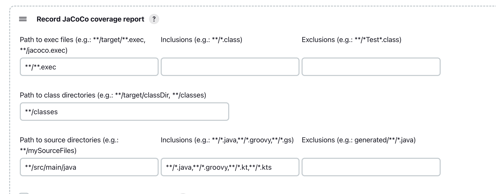

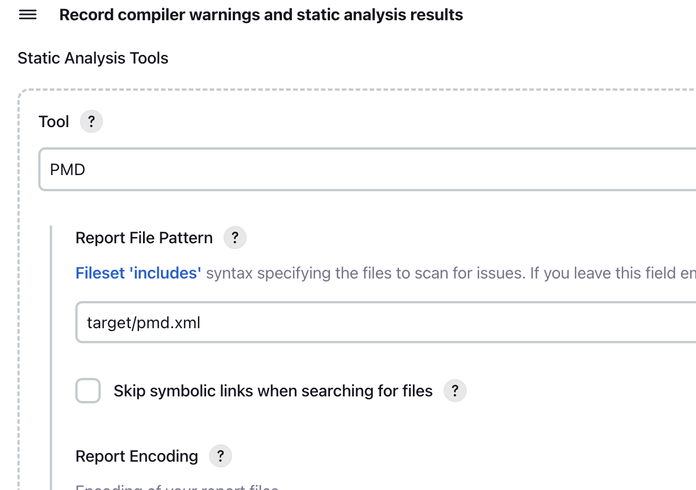

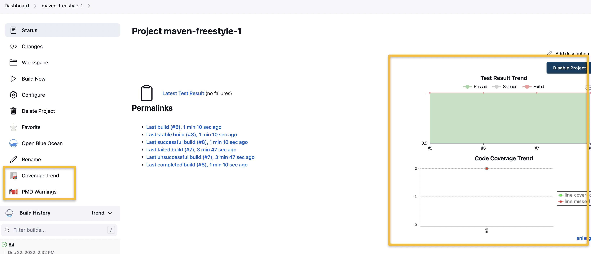